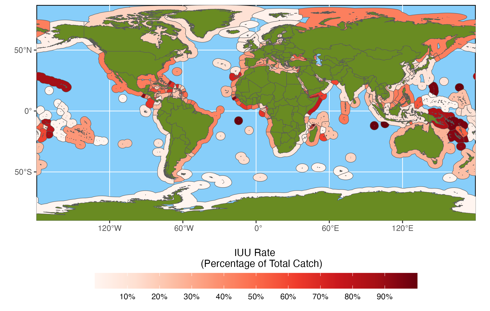

```{r}
#| label: iuu-map
#| include: false

library(tidyverse)
library(sf)

glob_data <- read_csv("global_catch.csv")
subs_eff <- read_csv("subs_effects.csv")
subs_eff2 <- read_csv("subs_effects2.csv")
ame_sfi <- read_csv("ame_sfi.csv")

glob_data <- glob_data %>% mutate(catch = catch / 1000000)

```

```{css}
.caption {
text-align: right;
line-height: 1;
font-size: 0.75em;
}
```

{#fig-map}

::: caption
***Disclaimer:** Maritime boundaries depicted are for research purposes\
only and are not to be considered legally authoritative\
delimitations of international boundaries and claims*

**Sources:** Fish catch data sourced from the [Sea Around Us](http://www.seaaroundus.org) project.\
EEZ spatial data sourced from [Flanders Marine Institute](https://www.vliz.be/en).
:::

At a January maritime security forum, Rear Admiral Jo-Ann Burdian made headlines for asserting that [illegal fishing had surpassed piracy](https://www.sportfishingmag.com/news/illegal-fishing-worse-than-piracy/) as a top concern of the U.S. Coast Guard. As the head of strategic response doctrine and policy guidance for the Coast Guard, Burdian noted that illegal, unreported, and unregulated (IUU) fishing threatens the food security of many coastal nations and has already led to [clashes at sea](https://www.newsweek.com/china-seeks-maritime-dominance-gunboat-filled-fishing-fleets-1673672) between international fishing fleets. While the total volume of IUU fishing has declined somewhat in recent years as international bodies have focused greater attention on the issue (see @fig-global-chart below), it continues to be a significant problem, with the [Sea Around Us](http://www.seaaroundus.org) project estimating more than 24 million tons of global IUU fish catch in 2019, the most recent year for which such estimates are available. Aggregate totals such as these also obscure the fact that while some regions have dramatically reduced IUU fishing, in other countries like Guinea-Bissau and Sierra Leone it has more than doubled over the past decade. The map above displays IUU catch as a percentage of total fish catch by exclusive economic zone (EEZ) for the year 2019.

The desire to find effective solutions to the problem of IUU fishing has naturally prompted growing interest in understanding the underlying factors that drive the activity. As a distinctly economic form of crime, existing research has understandably focused on the economic factors and regulatory regimes that shape the profitability and risks associated with IUU fishing. To date, however, research efforts have largely overlooked corruption as a possible factor. As a result, the potential role of corruption in illegal fishing remains an open question, which we will begin to explore here.

```{r}
#| label: fig-global-chart
#| fig-cap: Total Global Fish Catch

ggplot(glob_data, 
       aes(fill = factor(reporting_status, levels = c("Unreported", "Reported")), 
           x = year, y = catch)) +
  geom_bar(position = "stack", stat = "identity") +
  scale_fill_discrete(name = "Catch Status") +
  scale_x_continuous(breaks = glob_data$year) +
  theme(axis.text.x = element_text(angle = 270, vjust = 0.5)) + 
  labs(x = "Year", y = "Fish Catch\n(Tons, millions)", 
       caption = "Data source: Sea Around Us project")
```

**Key Drivers of IUU Fishing**

Existing research on the drivers of IUU fishing largely follows the conceptual framework of a foundational [2005 OECD study](https://www.oecd.org/greengrowth/fisheries/whyfishpiracypersiststheeconomicsofillegalunreportedandunregulatedfishing.htm) in drawing potential causal factors from two broad categories: economic and institutional (see for example, [Petrossian](https://doi.org/10.1016/j.biocon.2014.09.005), [Leonardo and Deeb](https://iopscience.iop.org/article/10.1088/1755-1315/1081/1/012013), and [Le Gallic and Cox](https://doi.org/10.1016/j.marpol.2005.09.008)). Economic factors influence the expected benefits of engaging in IUU fishing and include elements such as excess fishing sector capacity, fishing subsidies, fish prices, the presence of lucrative fish species, and general economic conditions and prospects for legitimate alternative opportunities. Institutional factors, on the other hand, largely shape the perceived risks and costs that offset the economic gains that can be attained through IUU fishing. Key institutional factors include gaps in international legal frameworks, the nature and severity of penalties, and the capacity and effectiveness of states' Monitoring, Control, and Surveillance (MCS) programs. Together, these various factors determine the overall profitability of IUU fishing (the financial gain minus costs and risks) and the prevalence of the activity can be thought of as directly related to its attractiveness in comparison to alternative economic opportunities.

For obvious reasons, research on institutional factors has placed a pronounced emphasis on MCS as a direct determinant of the likelihood of detection and punishment of illegal fishers. The approach to such research, however, has almost exclusively focused on measures of capacity, such as numbers of patrol boats or military expenditures. While these resources are an important component in MCS, they alone do not adequately speak to the effectiveness of MCS efforts. The ultimate impact of MCS also depends on the extent to which resources are being actively devoted to combatting IUU in comparison to other security priorities, as well as the actual rigor of enforcement of fishing rules when violations are observed. It is with respect to this enforcement aspect that corruption becomes particularly relevant.

Corruption directly undermines the deterrence effects of enforcement by substantially reducing the risk and cost of punishment. [Criminological deterrence theory](https://www.jstor.org/stable/1830482) holds that deterrence effects are directly linked to the certainty and severity of punishment. When a climate of corruption prevails, however, would-be lawbreakers recognize that even if caught, they can generally avoid punishment for the comparatively low cost of a bribe. This reduction in the risk of punishment effectively increases the perceived net profitability of criminal activity. As a result, we can expect to see higher rates of IUU fishing for countries in which corruption is more prevalent.

**The Role of Corruption**

To examine the real world effects of corruption on IUU fishing, we have constructed a Generalized Estimating Equation model for data from 116 coastal countries for the years 1995 to 2016, resulting in 2371 individual state-year observations. IUU catch data is sourced from the [Sea Around Us](http://www.seaaroundus.org) project and is presented as a percentage of the country's total fish catch to adjust for vast differences in fishery size and production and provide a basis for meaningful comparisons between countries. As a point of reference, the IUU percentage data has an average value of 37.03% across all state-years, with half of all values falling between 19.44% and 50.94%. Corruption is measured using the Political Corruption Index in the [Varieties of Democracy](https://www.v-dem.net) dataset, which scores countries from 0 to 1 with higher scores indicating higher levels of corruption. The model also includes controls for state weakness and regime type (using the State Fragility Index and Polity5 data respectively from the [Center for Systemic Peace](https://www.systemicpeace.org/index.html)), state security capacity (using military expenditures data from the [Correlates of War Project](https://correlatesofwar.org)), coastline length as a proxy for scale of the sea zone to be monitored (taken from the [CIA World Fact Book](https://www.cia.gov/the-world-factbook/)), and [World Bank](https://data.worldbank.org/) GDP per capita (purchasing power parity) and population data.

```{r}
#| label: fig-effects
#| fig-cap: Effects of Corruption on Predicted IUU Rate

ggplot(data = subs_eff, aes(x = vdem.corr, y = fit)) + 
  geom_line(color = "blue") +
  geom_ribbon(data = subs_eff, aes(ymax = ci_u, ymin = ci_l), fill = "red", 
              alpha = .25) +
  labs(x = "Corruption", y = "IUU Catch (as % of total catch)") +
  scale_y_continuous(labels = scales::percent)

```

The model results showed corruption to be statistically significant at the 99% confidence level, providing solid support for our hypothesis that corruption influences the rate of IUU fishing. @fig-effects above displays the specific effects of corruption on the IUU fishing rate with all other variables held constant at their average values. It shows that over the range of corruption scores, the rate of illegal fishing steadily increases from a low of 32.97% to 41.70%, equivalent to a change of roughly 1% for every change of 0.1 in the corruption index.

These effects are even more pronounced when we replace the Political Corruption Index score in the model with the more narrowly focused component indicator for bribery in the public sector (one of several components aggregated in the calculation of the composite index score). The statistical significance for the bribery indicator increases to the 99.9% confidence level and the effects on the IUU rate expand to a range of 30.30% to 42.69% (see @fig-bribe below). This further corroborates our theory of bribery of enforcement officials as the key mechanism linking corruption with IUU fishing.

```{r}
#| label: fig-bribe
#| fig-cap: Effects of Bribery on Predicted IUU Rate

ggplot(data = subs_eff2, aes(x = bribe, y = fit)) + 
  geom_line(color = "blue") +
  geom_ribbon(data = subs_eff2, aes(ymax = ci_u, ymin = ci_l), fill = "red", 
              alpha = .25) +
  labs(x = "Bribery", y = "IUU Catch (as % of total catch)") +
  scale_y_continuous(labels = scales::percent)
```

The model also showed that state weakness (as measured by the State Fragility Index) had a substantial impact on IUU fishing, but that other direct measures of security capabilities such as military expenditures and the commonly used [Composite Index of National Capabilities](https://correlatesofwar.org/data-sets/national-material-capabilities/) did *not* meaningfully influence IUU outcomes. Again, this casts doubt on the capabilities-centric approach to MCS evaluation that prevails in current IUU research. Also interesting, however, is the interplay between state weakness and corruption. @fig-sfi below plots the marginal effects of corruption relative to values in the State Fragility Index and demonstrates that the impact of corruption becomes larger as state weakness increases. This behavior was identical for model using the bribery indicator and is not being separately displayed.

```{r}
#| label: fig-sfi
#| fig-cap: Marginal Effects of Corruption by State Weakness

ggplot(data = ame_sfi, aes(x = sfi, y = ame)) + 
  geom_line(color = "blue") +
  geom_ribbon(data = ame_sfi, aes(ymax = ci_u, ymin = ci_l), fill = "red", 
              alpha = .25) +
  labs(x = "State Fragility Index", y = "")
```

**Implications for Policy**

Without a doubt, improvements in Monitoring, Control, and Surveillance mechanisms are crucial to combatting IUU fishing and effective fisheries management. However, these results suggest that strategies that solely focus on capabilities development are likely to have a limited effect. If left unaddressed, pervasive corruption can be expected to exert a powerful mitigating impact on any such efforts. This highlights the simple, but often neglected, truth that detection and enforcement are not one and the same. Effective MCS requires both the ability to identify and interdict illegal fishers and the professionalism to properly and consistently enforce the laws. Thus, capability-building must emphasize performance standards and anti-corruption measures wherever necessary.
